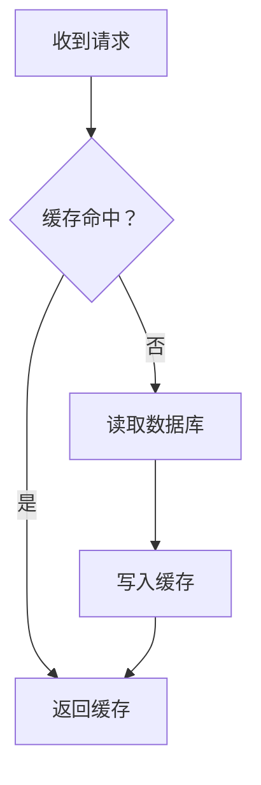
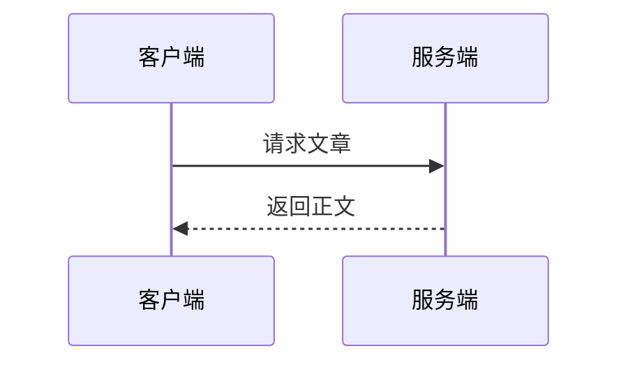

# Yggdrasil 文章写作

面向 Yggdrasil 的 Markdown 正文创作。根据内容选择能帮助读者理解或动手验证的功能，不必每篇文章都用齐。遵循用户指定的语言、风格、结构与交付范围。

## 正文与元数据

- 正文使用 Markdown，提交给 MCP 的 `content_md`。标题、摘要、标签、封面和发布状态属于独立字段，不要把 YAML frontmatter 当成文章元数据提交。
- 页面已有文章标题，正文通常从 `##` 开始，用 `###` 细分。系统自动生成目录和标题锚点，不需要手写目录 HTML。为兼容后台富文本编辑器，主要使用 H2/H3，避免重复的小节标题。
- 普通段落、链接、图片、引用、列表、粗体、斜体、删除线、分割线、表格与任务列表均可使用。
- 下列示例外层四反引号用于展示 Markdown 源码，写文章时只取其中的内容。

## 可运行代码块

需要读者运行的完整示例，在围栏语言名后加 `runnable`。普通代码块只有高亮和复制功能，不会自动变成运行器。

````markdown
```python runnable
numbers = [2, 4, 6]
print(sum(numbers))
```
````

这段代码的预期输出是 `12`。在正文说明示例的作用和预期结果；只有实际执行验证后才能说“已验证”。

内置运行语言如下，部署可进一步缩小可用范围：

| 围栏语言 | 运行环境 | 可接受别名 | 内置默认超时 / 内存 |
| --- | --- | --- | --- |
| `python` | Python | 无 | 5 秒 / 256 MB |
| `node` | Node.js | `js`、`javascript` | 5 秒 / 256 MB |
| `bun` | Bun，支持 TypeScript | `ts`、`typescript` | 5 秒 / 256 MB |
| `go` | Go，编译并执行 | 无 | 10 秒 / 256 MB |
| `rust` | rustc，编译并执行 | `rs` | 15 秒 / 512 MB |

写作约束：

- 每块作为独立单文件程序编写，不依赖上一块的变量、文件或进程。Go 带 `package main` 与 `func main()`，Rust 带 `fn main()`。
- 优先使用标准库和代码中自带的数据；不假定第三方依赖已安装，不依赖读者的本地文件、数据库或密钥。
- 当前内置语言均不允许网络；写 `allow_network:true` 也无法解除语言级限制。网络请求示例通常用普通代码块展示。
- 阅读器终端只输出，不提供 stdin。不要使用等待输入的 `input()`、交互提示或常驻服务作为可运行示例。
- Node/Bun 运行器不是浏览器，不提供 DOM 页面预览。HTML/CSS、Vue、Shell、SQL 可以作为普通代码示例，不能因此标记为可运行。
- 默认输出上限为 1 MiB，源码默认上限为 64 KiB，实际限制受服务器配置约束。运行按钮正常工作还依赖部署的 Docker 和对应镜像。

例如 TypeScript：

````markdown
```typescript runnable
const square = (n: number): number => n * n;
console.log(square(7));
```
````

仅在确有需要时覆盖资源限制。JSON 必须紧凑地写在同一行，**不能含空白，且要提供全部五个字段**：

````markdown
```python runnable {"cpu_cores":1.0,"memory_mb":256,"timeout_secs":10,"output_bytes":1048576,"allow_network":false}
print(sum(range(1000)))
```
````

当前解析器会忽略字段不完整或被空白拆开的 JSON，例如 `{"timeout_secs":10}` 并不生效。配置只能在服务器上限内调整。`run` 也是可识别标记，创作时统一用 `runnable`。

如当前连接提供 `run_code` 且具备 admin 权限，可用 `language` 和 `source` 验证示例，检查 `status`、`exit_code`、`stdout` 和 `stderr`。该工具不接受围栏资源覆盖参数；它验证的是默认限制下的代码。不可用时如实说明未执行，不必因此阻止交付文稿。

## Mermaid 流程图与关系图

使用语言标记恰为 `mermaid` 的围栏，正文保留 Mermaid 源码，不要转换成图片或手写 SVG。

````markdown

````

调用顺序适合时序图：

````markdown

````

站点在浏览器中渲染图表，自动适配明暗主题，并支持点击放大、缩放和平移。使用简短节点 ID，将中文或含标点的流程图标签放在引号中。复杂图拆成多个有说明的小图；窄屏优先考虑 `TD` 布局。

采用 Mermaid 内置图表语法。站点使用 strict 安全模式，不依赖点击回调、自定义脚本或外部插件。通常不写主题初始化指令和固定颜色，让站点统一处理主题。服务端保存成功不代表 Mermaid 已在浏览器渲染成功。

## 数学、物理与化学公式

行内公式使用 `$...$`，独立公式使用 `$$...$$`，内容是 TeX，不要再包代码围栏：

````markdown
时间复杂度为 $O(n \log n)$。

$$
\sum_{i=1}^{n} i = \frac{n(n+1)}{2}
$$
````

站点使用 KaTeX，并补充了物理宏及化学公式处理：

````markdown
导数：$\dv{f}{x}$，偏导：$\pdv{f}{t}$，范数：$\norm{v}$。

量子态内积：$\braket{\phi}{\psi}$。

$$
\ce{2H2 + O2 -> 2H2O}
$$

温度为 $\pu{298 K}$。
````

可用扩展包括 `\RR`、`\ZZ`、`\NN`、`\QQ`、`\CC`、`\dd{...}`、`\grad`、`\divg`、`\curl`、`\bra{...}`、`\ket{...}`、`\expval{...}`、`\abs{...}`、`\vu{...}`、`\qty{...}`。这些是项目宏，并不等于加载了完整的 LaTeX physics 宏包；优先采用这里展示的花括号参数形式。散度用 `\divg`，`\div` 仍表示除号。

Markdown 源码中保留单个反斜杠；如果手写 JSON 参数，要按 JSON 规则转义反斜杠和换行。使用工具结构化参数时传入正常 Markdown 字符串，避免二次转义。

## 脚注、表格与任务列表

````markdown
这项结论有额外的适用条件[^conditions]。

| 方案 | 适用情况 |
| --- | --- |
| 缓存 | 重复读取 |
| 批处理 | 可延迟执行 |

- [x] 明确输入范围
- [ ] 评估极端情况

[^conditions]: 假设输入数据在一次计算期间保持不变。
````

脚注使用 GFM 语法，系统自动编号，并提供返回引用处的链接。将脚注定义集中放在正文末尾；多段脚注的续段缩进四个空格。任务列表在阅读页展示完成状态，不是读者可保存进度的交互清单。

## 图片与折叠内容

图片使用 ``，阅读页提供图片灯箱。URL 使用可访问的 HTTPS 地址或真实的站内根路径（如素材工具返回的 `/uploads/...`），不要写本机路径、`data:` URI 或凭空构造素材地址。

配图优先复用已有素材。当前连接提供 `list_assets` 且令牌具备 admin 权限时，可按 `query` 搜索文件名或 alt；返回的 `path` 加 `/uploads/` 前缀即为图片 URL，`refs` 可查看引用情况。封面使用独立的 `cover_image` 字段。

上传图片需要 write 或 admin 权限，支持 JPEG/PNG/GIF/WebP，最大 5 MiB：

- 远程图片：调用 `upload_media`，传入 HTTPS `url` 和可选 `alt`。该工具不接收本地路径或 Base64。
- 本地图片：客户端具备 HTTP 或 shell 能力且已配置令牌时，调用 `POST /api/mcp/upload`，使用 Bearer 鉴权及 multipart 的 `file`、可选 `alt` 字段。两字段顺序不限；仅连接 MCP 工具并不自动具备本地文件上传能力。

两条通道均返回 `asset_id`、`url`、`alt`、尺寸、最终 MIME 和 `reused`。使用实际返回的 URL；重复上传返回相同素材 ID，省略 alt 保留旧值，空白清除。具有 admin 权限时可用 `update_asset_alt(id, alt)` 修改素材说明。素材 alt 不会回写已有文章，正文仍需填写 Markdown 图片替代文本。

素材删除、批量删除、孤儿清理与索引重建属于独立管理操作，不作为写作收尾自动执行；被草稿、回收站文章等引用的素材同样受删除保护。

文章服务端允许 `details` / `summary`，可用于补充推导或参考答案：

````markdown
<details>
<summary>查看推导</summary>

这里写补充说明，保留标签与 Markdown 内容之间的空行。

</details>
````

后台富文本编辑器没有对应折叠节点扩展，不应保证这种原始 HTML 经编辑器再次保存后无损。需要反复在后台编辑的内容优先用普通小节。

正文经过 HTML 清理，不支持嵌入任意 `<script>`、`<style>`、`<iframe>` 或事件处理属性。不要把 MDX 组件、Obsidian `[[双链]]`、`:::tip` 容器或任意第三方插件语法当成已支持功能；提示信息可以写成普通引用 `> **提示：** ...`。

## 通过 MCP 交付文章

先查看当前连接实际暴露的工具与 schema；工具名可能带连接器前缀，部署版本也可能尚未提供下列新工具。以下使用本地工具名称，以实际可用能力为准。

### 查找与读取

- 公开内容：`search_posts(query, limit?)`、`get_post(slug)` 和 `list_tags()` 使用 read 或更高权限。搜索和读取仅返回公开已发布文章；标签工具列出全部标签及各自的已发布文章数。
- 自己的文章：write 或 admin 权限可用 `list_posts`，支持 `status`（`draft` / `published`）、`query`（标题搜索）、`page`（从 1 开始）、`per_page`（1–50，默认 20）；省略状态返回全部未删除文章。查草稿可传 `{"status":"draft","page":1}`。
- 编辑前用 `get_post_by_id(post_id)` 读取完整正文、摘要、封面、标签、状态及 `updated_at`。私有查询和文章修改都限令牌用户自己的文章，admin 令牌也不扩大作者范围。

### 保存与更新

- `create_post` 必填 `title`、`content_md`；可选 `summary`、`slug`、`tags`、`status`、`cover_image`、`published_at`。`status` 默认为 `draft`，发布用 `published`。摘要省略时自动提取，slug 省略时自动生成。
- `update_post` 用 `post_id` 定位，按 PATCH 语义只传需要修改的字段；但 `content_md` 是完整替换正文，不是文本补丁。先读取现有全文，再合入本次改动。若部署暂未提供私有读取工具，使用已有完整原文；缺失时请用户提供，不要凭空覆盖正文。
- schema 提供 `expected_updated_at` 时，将读取结果的 `updated_at` 原样传入（RFC 3339，保留小数秒精度）。服务端原子校验版本，成功返回新的 `updated_at`；收到 `conflict` 时，重新读取并合并更改后再提交，不要删除版本参数绕过冲突。该参数在接口中可选，编辑已有文章时优先使用。
- 更新正文而省略 `summary` 会重新自动提取摘要；要保留人工摘要时一并传入。`tags` 整体替换，空数组清空；`cover_image` 空字符串清空封面。
- 自定义 slug 仅用字母、数字、连字符和下划线。以工具实际返回的 slug 为准，冲突时可能自动去重。`published_at` 可用 ISO 8601 或 `YYYY-MM-DD`，不需要指定日期时省略。

用户只要文稿或“先看看”时，交付文稿；要求保存草稿时使用 `draft`；明确要求发布时按已有授权使用 `published` 或 `publish_post(post_id)`，无需重复确认。不要把撰写文章自动扩大为线上发布。

### 回收站与核验

用户要求找回文章时，用 `list_trashed_posts` 查找自己的回收站文章，筛选和分页参数与 `list_posts` 相同，再按授权调用 `restore_post(post_id)`。恢复会保留原发布状态，因此已发布文章恢复后会重新公开；slug 被占用时自动加后缀，使用恢复结果中的最终 slug。`trash_post` 是移入回收站，`delete_post` 是不可恢复的永久删除，两者不能互换。

保存或恢复后核对工具成功状态和返回的 `post_id` / `slug`，通过 `get_post_by_id` 回读正文及元数据；草稿不可用公开工具 `get_post` 回读，不要为核验而临时发布。已发布文章也可用 `get_post` 检查公开内容。如果有浏览器预览条件，再检查图表、公式和运行器。分别说明“已保存”“已发布”“代码已运行”“页面已检查”，只报告实际完成的验证。

## 交付前核对

检查围栏是否闭合、运行语言与完整程序是否匹配、Mermaid 标记是否正确、公式是否被误写成代码、脚注引用是否有定义、图片是否有真实 URL。确保所有示例占位内容都已替换，元数据与正文分开，保存或发布状态符合用户要求。

## 维护依据

本技能根据 2026-09-16 的 Yggdrasil 源码核对。使用技能写作不要求访问仓库；更新技能或发现部署行为不一致时，在仓库中查阅：

- `src/api/markdown.rs`、`src/api/sanitizer.rs`：正文语法、目录、HTML 与 URL 限制。
- `src/api/code_runner/languages.rs`、`src/infra/runner_config.rs`：运行语言、围栏参数和资源限制。
- `src/components/code_runner/runner.rs`：阅读器运行交互。
- `src/api/katex.rs`、`src/api/mhchem.rs`：公式与扩展宏。
- `libs/shared/src/index.ts`、`libs/yggdrasil-core/src/mermaid.ts`：图表配置与阅读页渲染。
- `libs/tiptap-editor/src/editor-extensions.ts`：后台编辑器支持范围。
- `src/mcp/tools/{posts,read,media,runner}.rs`：文章、素材与代码执行工具契约。
- `src/api/upload.rs`、`src/api/url_fetch.rs`、`src/api/posts/trash.rs`：上传入库、远程图片抓取及恢复语义。
